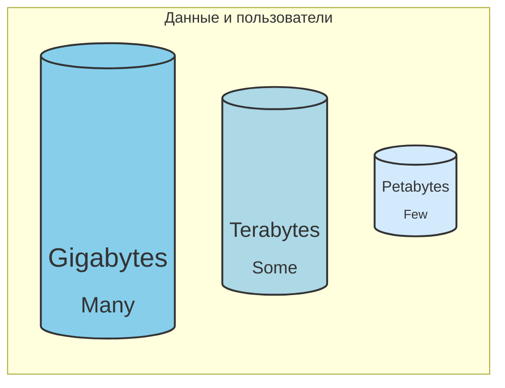

# С какими объёмами данных работает аналитика

Существуют миф, что каждый аналитик и дата-инженер работают с настоящей "Big Data".

Но это не так.

Реальные задачи аналитики чаще всего укладываются в диапазон от гигабайтов до, максимум, терабайтов данных. С
петабайтами работают единицы — это исключение, а не правило.

## Распределение объёмов данных в аналитике

- **Гигабайты/Gigabytes (GB)** — Сюда попадает львиная доля аналитики в компаниях — ежедневные отчёты, выгрузки из CRM,
  маркетинговые данные, логи за несколько месяцев.
    - **Инструменты:** DuckDB, SQLite, PostgreSQL, Pandas, Polars.
    - **DuckDB**: Здесь чувствует себя как рыба в воде — быстро, просто, без лишней инфраструктуры.
- **Терабайты/Terabytes (TB)** — Это уже крупные корпоративные DWH или Data Lake, исторические данные за годы, аналитика
  больших
  интернет-проектов, весь лог веб-сервиса за год и пр.
    - **Инструменты:** DuckDB, ClickHouse, GreenPlum, Spark.
    - **DuckDB:** справится с терабайтами, если есть достаточно диска/памяти и если оптимизировать его работу. Для
      сложных кейсов подключают кластерные (распределённые) решения.
- **Петабайты/Petabytes (PB)** — Аналитика уровня Big Tech. Это данные миллионов
  пользователей,
  стримы, клики, логи за десятки лет.
    - **Инструменты:** Apache Spark, Hadoop, Trino.
    - **DuckDB** не рассчитан на petabyte-scale задачи и распределённые вычисления.

### Какой инструмент для какого объёма?

| Объём                    | Инструменты                                | Где хорош DuckDB                                                                                  |
|--------------------------|--------------------------------------------|---------------------------------------------------------------------------------------------------|
| Гигабайты/Gigabytes (GB) | DuckDB, Pandas, Polars, SQLite, PostgreSQL | Идеален.                                                                                          |
| Терабайты/Terabytes (TB) | DuckDB, ClickHouse, GreenPlum, Spark       | Хорош в большинстве случаев. Идеален особенно если есть ресурсы и умение работать с оптимизацией. |
| Петабайты/Petabytes (PB) | Apache Spark, Hadoop, Trino.               | Не подходит.                                                                                      |

## Вывод

- 99% аналитики — это не petabyte scale.
- Для подавляющего большинства задач (Гигабайты/Gigabytes (GB), Терабайты/Terabytes (TB)) не нужны тяжёлые фреймворки и
  кластера.
- DuckDB отлично закрывает задачи в диапазоне GB-TB — быстро и просто.
- Выбирайте инструмент под задачу, а не под хайп.

**P.S.**  
Если вы не Google/Netflix, скорее всего, ваша аналитика отлично поместится в DuckDB. Spark и Hadoop нужны единицам.

