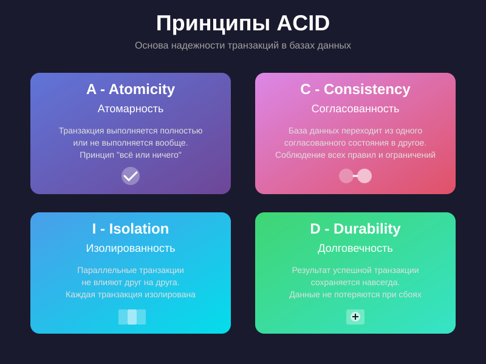

# ACID

ACID – это набор свойств, обеспечивающих надёжность транзакций в базах данных:

- **Atomicity (Атомарность)** – транзакция либо выполняется полностью, либо не выполняется вовсе. Если произошла ошибка,
  всё возвращается к исходному состоянию.
- **Consistency (Согласованность)** – после выполнения транзакции база данных остаётся в корректном состоянии, не
  нарушая заданные ограничения.
- **Isolation (Изолированность)** – параллельные транзакции не мешают друг другу, результат их совместного выполнения
  такой же, как если бы они выполнялись по очереди.
- **Durability (Надёжность)** – после фиксации транзакции её результат сохраняется даже в случае сбоя системы.

DuckDB обеспечивает транзакционность по ACID для большинства операций, что важно для воспроизводимой аналитики и
корректной работы при одновременном доступе.

