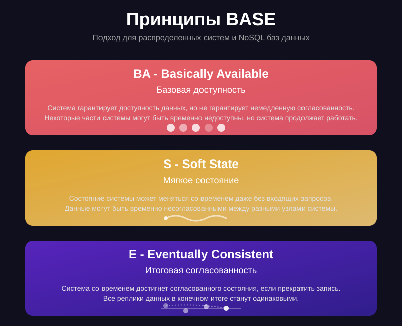

# BASE

BASE – это альтернативный подход, часто встречающийся в распределённых NoSQL-системах, где не всегда требуется строгая
согласованность:

- **Basically Available (Доступность)** – система всегда отвечает на запросы, даже если часть данных может быть
  недоступна.
- **Soft state (Гибкое состояние)** – состояние системы может меняться со временем, даже без новых операций (например,
  за счёт асинхронной репликации).
- **Eventual consistency (В конечном итоге согласованность)** – данные в итоге синхронизируются и приходят к
  согласованному состоянию, но не обязательно мгновенно.

DuckDB – система с приоритетом на ACID, а не BASE. Но важно знать про BASE, чтобы понимать, чем DuckDB отличается от
распределённых NoSQL-решений.

