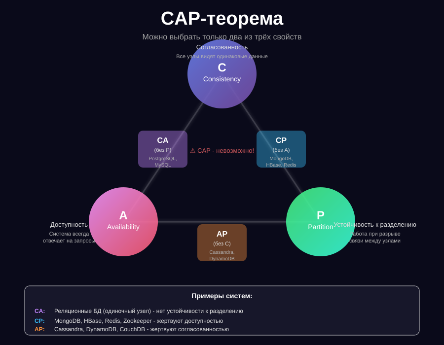

# CAP

CAP-теорема (Brewer’s theorem) утверждает, что в распределённой системе невозможно одновременно обеспечить три свойства:

- **Consistency (Согласованность)**
- **Availability (Доступность)**
- **Partition tolerance (Устойчивость к разделению сети)**
  Система может гарантировать только два из трёх. DuckDB – это не распределённая система (single-node, embedded),
  поэтому CAP-теорема напрямую её не ограничивает, но если вы думаете о масштабировании и кластерах, CAP становится
  важным.

