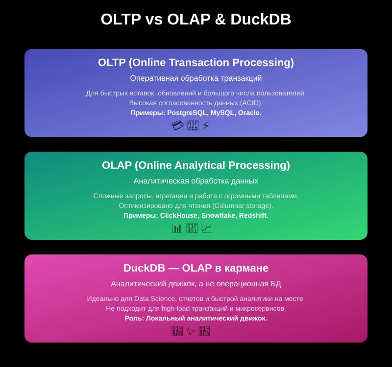

# Задача = Инструмент. Не забиваем гвозди микроскопом

В аналитике и работе с данными нет универсального инструмента на все случаи жизни.

Как в столярке: гвозди забивают
молотком, а винтики вкручивают отвёрткой — так и в дата-инженерии: под каждую задачу есть свой оптимальный подход и
технология.

## Простое объяснение на жизненных примерах

**Вы — учитель.** И вам нужно быстро найти конкретного ученика: посмотреть его оценки, исправить ошибку, добавить
комментарий. **Это задача поиска и обновления конкретных записей (OLTP).**  Используются: PostgreSQL, MySQL, SQLite.

**Вы — директор школы.**  Вас интересует средний балл по всем ученикам, сравнение классов, динамика по годам, выявление
лучших/отстающих предметов. **Это задача анализа агрегированных данных (OLAP).**  Используются: DuckDB, ClickHouse,
GreenPlum, Snowflake, BigQuery.

## OLTP vs OLAP — в чём суть?

- **OLTP (Online Transaction Processing)** – системы для оперативной обработки транзакций, характерны для банков,
  e-commerce, CRM и т.д. Основные требования – быстрые вставки, обновления, удаление данных, высокая согласованность и
  поддержка большого количества параллельных транзакций. Примеры: PostgreSQL, MySQL.
- **OLAP (Online Analytical Processing)** – системы для аналитических запросов: агрегации, сложные выборки, работа с
  большими объёмами данных. Требования: быстрые чтения, эффективная обработка запросов к большим таблицам, поддержки
  аналитических функций. Примеры: ClickHouse, Amazon Redshift, Databricks, DuckDB.

## Какую задачу каким инструментом решать?

| Пример задачи                                 | OLTP/OLAP | Лучшие инструменты      |
|-----------------------------------------------|-----------|-------------------------|
| Найти запись по `id` (ученик, клиент, заказ)  | OLTP      | PostgreSQL, SQLite, etc |
| Добавить/обновить одну строку                 | OLTP      | PostgreSQL, SQLite, etc |
| Мгновенно обновить статус заказа на сайте     | OLTP      | PostgreSQL, MySQL, etc  |
| Быстрый отчёт "*топ 10 продаж по категориям*" | OLAP      | DuckDB, ClickHouse, etc |
| Посчитать средний балл по всем классам        | OLAP      | DuckDB, BigQuery, etc   |
| Сравнить продажи по месяцам за 3 года         | OLAP      | DuckDB, Snowflake, etc  |
| Выгрузить все данные за месяц для анализа     | OLAP      | DuckDB, Spark, etc      |

### Ещё проще: не забиваем гвозди микроскопом

- Для задач по типу:"_поиск/добавление/обновление_" — OLTP, классические СУБД.
- Для задач по типу: "_анализ/отчёт/агрегация/сравнение_" — OLAP, аналитические движки.
 
**DuckDB = OLAP**. Не стоит пытаться строить на нём сайты, где каждый пользователь обновляет свои данные каждую
  секунду.

**DuckDB – это OLAP-движок** (анализ данных), а не OLTP (операционные транзакции). Это значит, что DuckDB идеально
подходит для аналитики, построения отчётов, data science, но не для high-load продакшн-сервисов с миллионами
параллельных микротранзакций.

### Почему это критично?

Есть два "*основных*" подхода к управлению базами данных:

1) WORM (Write Once, Read Many) — характерен для OLAP/аналитики: данные редко изменяются, их много раз читают для
   анализа.
2) CRUD (Create, Read, Update, Delete) — характерен для OLTP: данные часто вставляют, обновляют, удаляют, ищут по ключу.

## Вывод

- OLTP-инструменты оптимизированы под частые мелкие операции, а не под массивные выборки и агрегации.
- OLAP-инструменты оптимизированы под "_чтение много, запись редко_", быстрые сложные запросы, агрегации, аналитику по
  большим объёмам данных.
- Задача определяет инструмент. Не используйте Spark для выгрузки 10 строк, DuckDB для highload-сайта, PostgreSQL для
  анализа 10 терабайт логов.
- Понимание разницы между OLTP и OLAP экономит время, деньги, нервы и улучшает качество аналитики.
- Если выбрать не тот инструмент, всё будет медленно, неудобно и дорого.

Если задача — анализировать, агрегировать, строить отчёты, делать Data Science — DuckDB ваш друг.

Если задача — быстро искать и обновлять отдельные записи — лучше выбрать классическую СУБД.