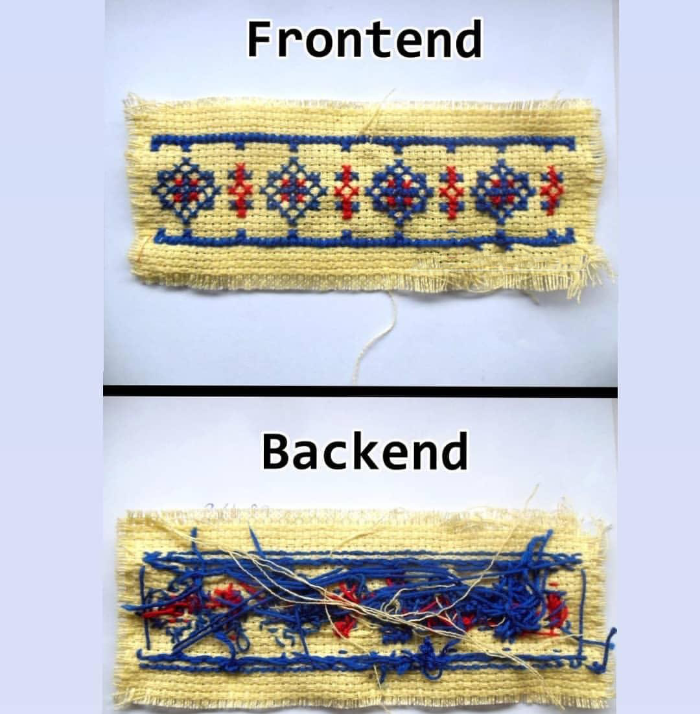
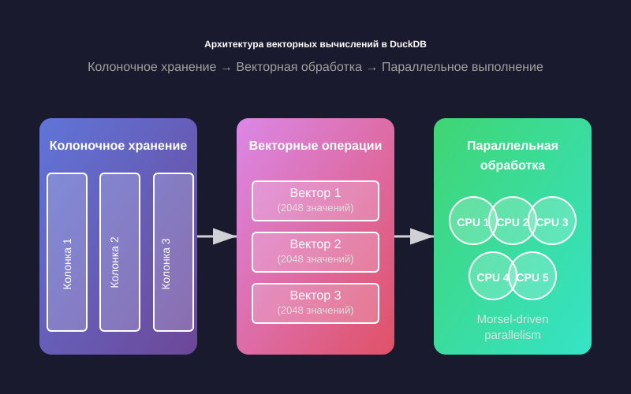
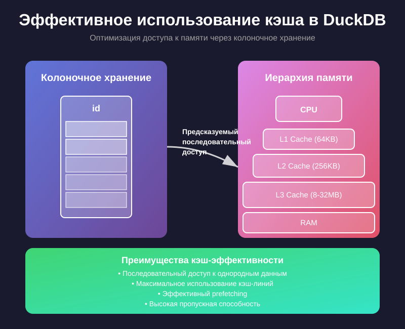

# Архитектура DuckDB

Я часто показываю данную картинку, потому что она многое объясняет и показывает как работает технология.

К примеру, когда мы выполняем команду `SELECT * FROM tbl` для нас — это некий Frontend, мы описали что хотим получить. А
на Backend уже происходят разные механизмы получения данных из таблицы `tbl`.

Поэтому сегодня мы рассмотрим разные "*стороны*" DuckDB: мы окунёмся в возможности DuckDB, поговорим об алгоритмах
работы DuckDB, поговорим о реальных кейсах использования DuckDB и также обсудим тонкости DuckDB.

## Внутреннее устройство DuckDB

DuckDB — это ACID, OLAP, Embedded база данных. Это значит, что DuckDB работает с понятием "*транзакция*" и предназначена
для OLAP-нагрузки и основное — не имеет привычного кластера (login:password@host:port).

У DuckDB подход — чистый SQL. Не нужно писать свой код на Python, Java, C++. Просто пишем на SQL и он сам отработает
"*под капотом*". Но сторонний код не исключается, об этом поговорим позже.

DuckDB использует [векторные вычисления](https://duckdb.org/docs/stable/internals/vector).

DuckDB использует все ресурсы, что у вас есть, его не нужно "*заставлять*" использовать: параллелизм, все потоки, всю
оперативную память. Но в то же время его можно ограничить, чтобы он всё не "*съел*" — [Configuration](https://duckdb.org/docs/stable/configuration/overview).

Хоть DuckDB не рассматривается как кластерное решение, но в DuckDB всё равно реализован
MVCC — [Concurrency](https://duckdb.org/docs/stable/connect/concurrency). Что позволяет создать базу данных DuckDB
физически и читать её разными процессами.

## Вычисления в DuckDB

Мы сейчас немного забежим вперёд, но в дальнейшем разберёмся с этим более подробно.

При работе с DuckDB есть два варианта:

1) Работать с DuckDB как интерфейсом для взаимодействия с данными (читать `.csv`, `.parquet` и другие файлы в памяти,
   без сохранения физически в DuckDB)
2) Работать с движком DuckDB (создавать таблицы физически в DuckDB)

В зависимости от подхода к взаимодействию с DuckDB будут применяться разные эвристики.

К примеру, если вы будете читать `.csv` файл, который находится в S3 или на другом источнике, то у вас не будут
применяться разные алгоритмы сжатия и сортировки данных.

А если вы прочитаете данные из `.csv` и положите их физически в DuckDB, то DuckDB применит алгоритмы сжатия, сортировки
и векторизации на данные.

\# Пример (упрощённый):
Вектор — это упорядоченный список чисел или других объектов: строки, функции, пр.

Вектор можно представить так:
$$
x=[1, 4, 5, 6]
$$
Или так:
$$  
y = [\text{'a'}, \text{'a'}, \text{'a'}, \text{'b'}, \text{'a'}, \text{'b'}, \text{'b'}, \text{'c'}, \text{'b'}, \text{'b'}, \text{'b'}]  
$$
И соответственно, в зависимости от вектора к нему можно применить разные алгоритмы сжатия.

Если рассмотреть вектор $y$, то к нему можно
применить [алгоритм сжатия RLE](https://neerc.ifmo.ru/wiki/index.php?title=%D0%90%D0%BB%D0%B3%D0%BE%D1%80%D0%B8%D1%82%D0%BC_RLE)
и мы получим такой результат:
$$
y = \left\{ (\text{a},\ 3),\ (\text{b},\ 1),\ (\text{a},\ 1),\ (\text{b},\ 2),\ (\text{c},\ 1),\ (\text{b},\ 3) \right\}
$$
Далее DuckDB разделяет это всё на $chunk$ размерностью 2048 значений и раскидывает между CPU и RAM:

Также стоит сказать, что DuckDB использует SIMD-инструкции. К примеру, есть такое понятие как "*инструкции процессора*".
И DuckDB применяет все возможные инструкции, которые поддерживает ваш процессор.

Поэтому, если у вас старый процессор, то у вас не будет части современных инструкций и соответственно код будет работать
медленнее.

> \# Пример (упрощённый):
У вас есть два числа $a$ и $b$ и вам необходимо поделить одно на другое, но ваш компьютер не умеет это делать и
необходимо реализовать свою инструкцию.
>
>Вам необходимо учесть деление на ноль, деление отрицательных чисел, деление на бесконечность и прочее.
>
>И как вы запрограммируете данную инструкцию так она и будет работать в будущем.

И DuckDB как раз применяет данные инструкции для быстрых расчётов векторов.

Также он использует разные уровни кэша вашего процессора:

Если хотите изучить подробнее работу "*под капотом*", то рекомендую видео:

- [DuckDB: How to Build 100x Faster Analytics Databases (with Co-Creator Hannes Mühleisen)](https://www.youtube.com/watch?v=pZV9FvdKmLc)
- [@duckdb‬ Internals with Mark Raasveldt ‪@duckdb3282‬](https://youtu.be/f9QlkXW4H9A?si=8_zhJBVGtqjpLVQ6) 