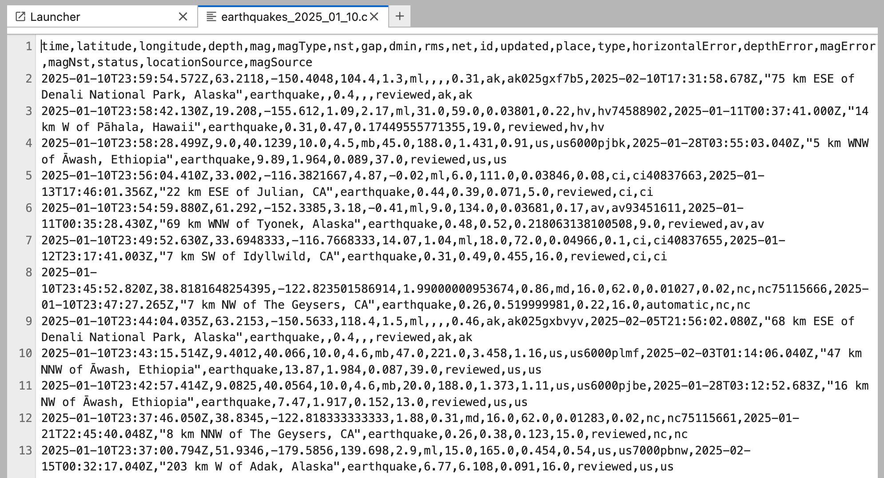
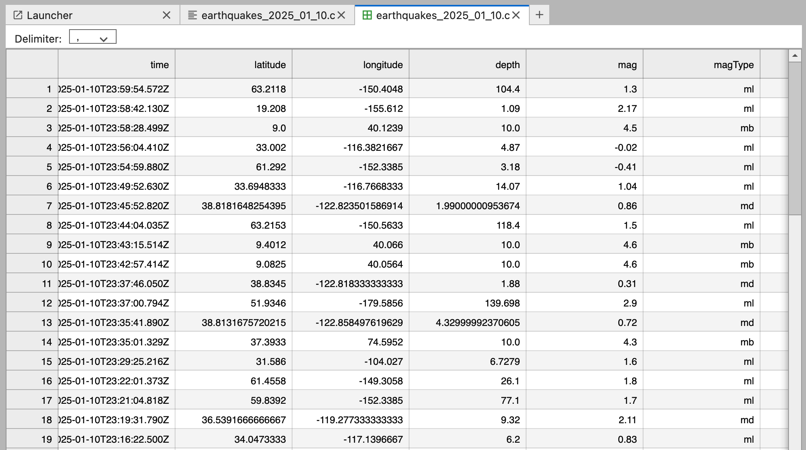
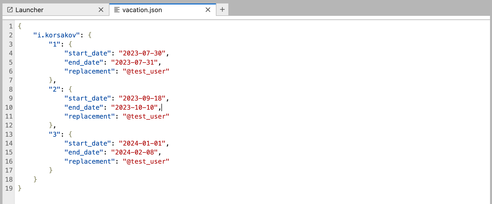
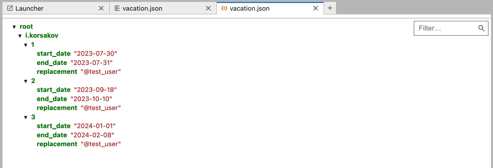

# Частые форматы файлов в дата-инженерии

В работе дата-инженера приходится постоянно сталкиваться с разными форматами хранения данных. Самые распространённые из
них:

- `.csv`
- `.json`
- `.parquet`

Каждый из них нужен для своих задач, и важно понимать их плюсы и минусы.

## CSV (Comma-Separated Values)

- **Что это:**
    - Табличный текстовый формат, где строки — это записи, а столбцы разделены запятыми (или другим разделителем).
- **Плюсы:**
    - Максимально прост — легко открыть в любом редакторе, Excel, Google Sheets.
    - Универсален — поддерживается почти везде.
- **Минусы:**
    - Нет информации о типах данных — всё строки.
    - Нет поддержки вложенных структур (только плоские таблицы).
    - Нет встроенного сжатия (разве что архивировать отдельно).
    - Не хранит метаданные (описание, схема).
    - Может быть любой разделитель.
    - Сложно работать с кавычками.
- **Когда использовать:**
    - Для простого обмена табличными данными между системами.
    - Когда важна совместимость и человекочитаемость.

## JSON (JavaScript Object Notation)

- **Что это:**
    - Текстовый формат для хранения структурированных (вложенных) данных: объекты, массивы, числа, строки и т.д.
- **Плюсы:**
    - Поддержка вложенных структур (деревья, списки, объекты).
    - Гибкость, часто используется для хранения логов, событий, конфигов.
    - Читается и пишется почти на любом языке.
- **Минусы:**
    - Неэффективен для больших объёмов табличных данных.
    - Нет явной схемы — структура может быть разной в каждой записи.
    - Нет встроенного сжатия.
- **Когда использовать:**
    - Для хранения и передачи semi-structured (слабоструктурированные данные) данных (логи, API, сложные объекты).
    - Когда нужна вложенность и гибкость.

## Parquet

- **Что это:**
    - Колоночный бинарный формат, специально созданный для аналитики и больших объёмов данных.
- **Плюсы:**
    - Колоночное хранение — ускоряет аналитические запросы (чтение только нужных столбцов).
    - Сжатие — поддерживает эффективные алгоритмы сжатия "на лету".
    - Мета-стор — хранит в себе схему, типы данных, статистику по каждому столбцу (`min`/`max`/`NULL`), что
      позволяет быстро понимать структуру и быстро фильтровать данные.
    - Поддержка сложных типов — структуры, массивы, вложенные объекты.
- **Минусы:**
    - Не человекочитаемый (без спец. инструментов не открыть).
    - Не всегда подходит для потоковых/онлайн-сценариев.
- **Когда использовать:**
    - Для хранения больших аналитических датасетов.
    - Для эффективной передачи между аналитическими системами (Spark, DuckDB, ClickHouse, DWH).
    - Для организации Data Lake.

## Сравнение CSV и Parquet

| Свойство           | CSV            | Parquet                 |
|--------------------|----------------|-------------------------|
| Хранение           | Строчно        | Колоночно               |
| Размер файла       | Большой        | Меньше (за счёт сжатия) |
| Схема данных       | Нет            | Есть (встроена)         |
| Сжатие             | Нет            | Встроено                |
| Метаданные         | Нет            | Есть (встроены)         |
| Работа с типами    | Всё строки     | Поддержка типов         |
| Чтение             | Только целиком | Можно читать нужное     |
| Вложенность        | Нет            | Есть                    |
| Человекочитаемость | Да             | Нет                     |

**Главное преимущество Parquet — наличие мета-стора.**

Это значит, что DuckDB (или другая аналитическая СУБД) может за миллисекунды понять, что в файле, какие там столбцы,
какие типы, даже не читая весь файл.  
Это ускоряет работу с большими объёмами данных, позволяет быстро фильтровать, делать “_пробные_” запросы и экономить
ресурсы.

## Вывод

- Для обмена и простоты — `.csv`.
- Для сложных данных — `.json`.
- Для аналитики/больших данных — `.parquet` (рекомендуется использовать по максимуму).

DuckDB поддерживает все эти форматы “_из коробки_”, но свою полную мощь раскрывает именно с колоночными файлами вроде
`.parquet`.
