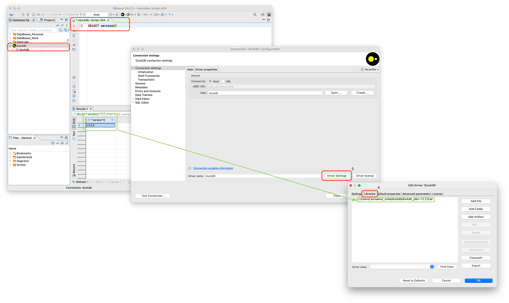
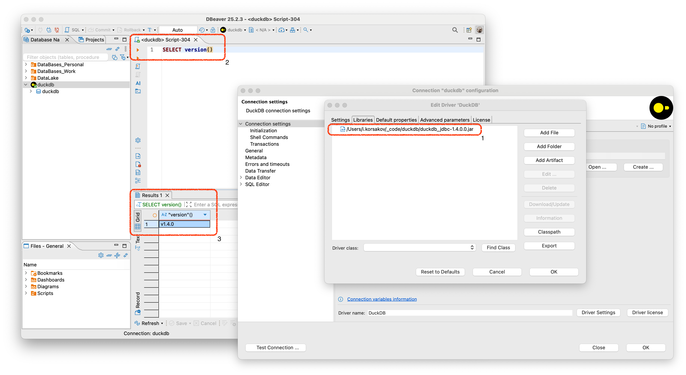

# Быстрый старт через DBeaver

Для установки DuckDB в DBeaver вам необходимо зайти в DBeaver и нажать на "*розетку*" 🔌:

У вас установятся все необходимые драйвера для работы DuckDB и вы сможете начать работу с DuckDB.
## Устранение проблем при обновлении драйвера DuckDB в DBeaver 
Стоит также оговориться, что иногда DBeaver некорректно может обновить пакеты и их необходимо обновить вручную.

Для этого перейдите на официальный [репозиторий DuckDB Maven](https://mvnrepository.com/artifact/org.duckdb/duckdb_jdbc), скачайте необходимую версию DuckDB, установите подключение к DuckDB в DBeaver (как на прошлом этапе). 

Затем зайдите в настройки подключения:
1) Нажмите на подключение ПКМ и выберите "***Edit connection***".
2) Предварительно можете выполнить запрос на получение версии. Он будет равен версии `.jar` пакета из пункта 4.
3) Нажмите "***Driver Settings***".
4) Выберите пункт "***Libraries***" и посмотрите какая версия пакета у вас установлена.

После этого скачайте необходимую версию с [репозитория DuckDB Maven](https://mvnrepository.com/artifact/org.duckdb/duckdb_jdbc). Сохраните локально. В пункте "***Libraries***" удалите старый драйвер и добавьте новый.

После этого если выполните запрос на получение версии и получите необходимую версию пакета:

