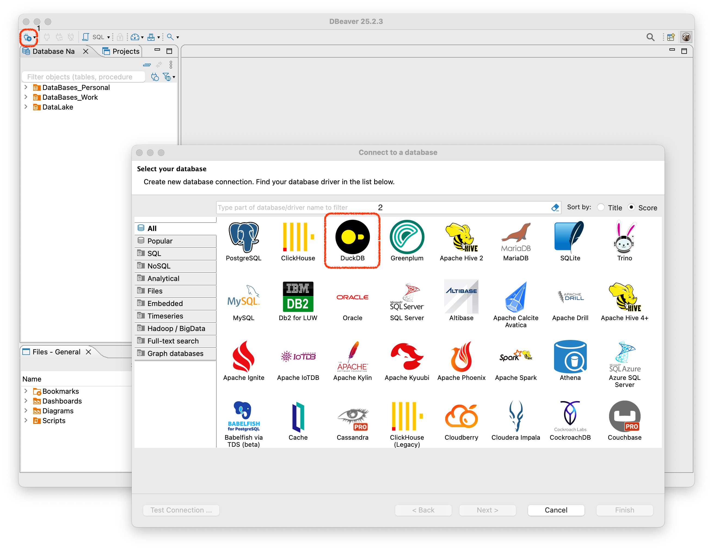

# Быстрый старт через DBeaver

Для установки DuckDB в DBeaver вам необходимо зайти в DBeaver и нажать на "*розетку*" 🔌:

У вас установятся все необходимые драйвера для работы DuckDB и вы сможете начать работу с DuckDB.

## Устранение проблем при обновлении драйвера DuckDB в DBeaver

Стоит также оговориться, что иногда DBeaver некорректно может обновить пакеты и их необходимо обновить вручную.

Для этого перейдите на
официальный [репозиторий DuckDB Maven](https://mvnrepository.com/artifact/org.duckdb/duckdb_jdbc), скачайте необходимую
версию DuckDB, установите подключение к DuckDB в DBeaver (как на прошлом этапе).

Затем зайдите в настройки подключения:

1) Нажмите на подключение ПКМ и выберите "***Edit connection***".
2) Предварительно можете выполнить запрос на получение версии. Он будет равен версии `.jar` пакета из пункта 4.
3) Нажмите "***Driver Settings***".
4) Выберите пункт "***Libraries***" и посмотрите какая версия пакета у вас установлена.

После этого скачайте необходимую версию
с [репозитория DuckDB Maven](https://mvnrepository.com/artifact/org.duckdb/duckdb_jdbc). Сохраните локально. В пункте 
"***Libraries***" удалите старый драйвер и добавьте новый.

После этого если выполните запрос на получение версии и получите необходимую версию пакета:

## Работа с DuckDB в DBeaver

### Работа в формате `in-memory`

После установки драйвера DuckDB необходимо создать подключение к DuckDB. Для этого также необходимо нажать на
"*розетку*" 🔌 и указать `Path`. `Path` можно указать любой, так как DuckDB позволяет работать в формате `in-memory`.

### Работа с ранее созданной БД

Также можно указать полный путь для чтения любой базы данных, которая у вас есть. Вот к примеру, путь до моей БД из
примера [02_quick_start_cli](../02_quick_start_cli):
`/Users/i.korsakov/_code/github/everything_about_DuckDB/02_quick_start_cli/duckdb.duckdb`

### Создание своей БД

Для того чтобы создать свою базу данных. Необходимо:

1) Нажать на "*розетку*" 🔌
2) Выбрать пункт `Create ...`
3) Указать `Path`
4) Начать работать с физической базой данных, которая будет сохранена по указанному пути.